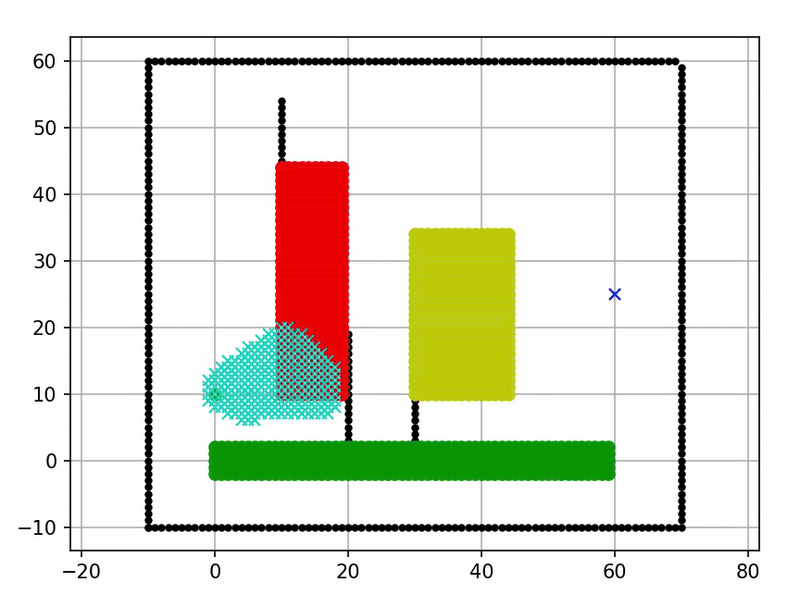
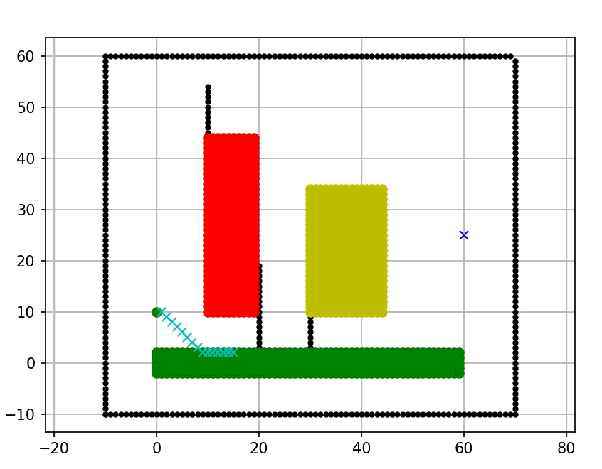
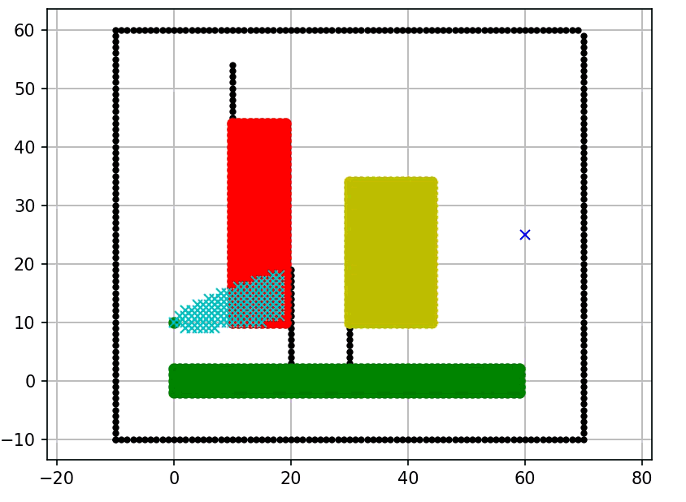
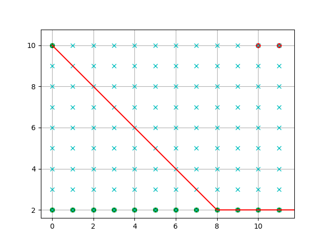
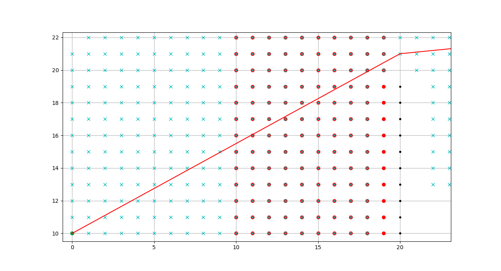

# AAE1001_25_Group_2
### Group Member:

*Phrolova, Nathan, David, Bob, Steven, Matthew


# TASK 1:

## Overview

This project presents a comprehensive analysis of various aircraft options in three distinct scenarios characterized by different passenger demands, fuel costs, time costs, and maximum flight counts. The objective is to identify the **optimal aircraft type** for each scenario based on cost and performance metrics.

## Table of Contents

- [Background](#background)
- [Scenarios](#scenarios)
  - [Scenario 1: Medium Passengers](#scenario-1-medium-passengers)
  - [Scenario 2: High Passengers](#scenario-2-high-passengers)
  - [Scenario 3: Low Passengers](#scenario-3-low-passengers)

## Background

- **Start node:** 0, 10
- **Goal node:** 60, 25
- **Key areas:** Fuel-consuming, Time-consuming


## The shortest path


## Shortest time required: 76.15432893255064

## Cost Calculation Equation


## Scenarios

### Scenario 1: 

- **Fuel Cost:** 0.85
- **Time Cost:** Medium
- **Number of Passengers:** 330
- **Maximum Flight:** 13

**Aircraft Costs:**
| Aircraft Type | Demand per Flight | Total Cost  |
|---------------|------------------|-------------|
| A330-900neo          | 11               | 99,403.26   |
| A350-900         | 10               | 103,819.73  |

A321neo do not meet the requirement in this situation.

**Optimal Aircraft:** **A330-900neo**  
**Cost:** 99,403.26

### Scenario 2: 

- **Fuel Cost:** 0.96
- **Time Cost:** High
- **Number of Passengers:** 1500
- **Maximum Flight:** 7

**Aircraft Costs:**
| Aircraft Type | Demand per Flight | Total Cost  |
|---------------|------------------|-------------|
| A330-900neo          | 5                | 50,986.26   |
| A350-900          | 5                | 58,344.91   |

A321neo do not meet the requirement in this situation.

**Optimal Aircraft:** **A330-900neo**  
**Cost:** 50,986.26

### Scenario 3: 

- **Fuel Cost:** 0.78
- **Time Cost:** Low
- **Number of Passengers:** 2250
- **Maximum Flight:** 25

**Aircraft Costs:**
| Aircraft Type | Demand per Flight | Total Cost  |
|---------------|------------------|-------------|
| A321neo          | 12               | 69,229.96   |
| A330-900neo          | 8                | 65,055.57   |
| A350-900          | 7                | 65,583.84   |

**Optimal Aircraft:** **A330-900neo**  
**Cost:** 65,055.57


<p align="center">

  <h1 align="center"> TASK 2: 
<p align="center">

  <h3 align="center"> Path Planning with Multiple Cost Zones </h3>

## Objective:
To implement an A* path planning algorithm that accounts for multiple types of cost-intensive areas:

Fuel-consuming areas (yellow)

Time-consuming areas (red)

Newly defined special-cost areas (green)

Implementation:

Extended the AStarPlanner class to incorporate three cost modifiers:

Delta_C1 = 0.2 for fuel-consuming zones

Delta_C2 = 1 for time-consuming zones

Delta_C3 = 0.05 for special-cost zones

The algorithm adjusts node cost when passing through these zones

Visualization includes plotting all three zones in different colors

Created a new special-cost area defined by coordinates and plotted in green

Results:

Final Route Time: 74.46793283 units

The path successfully avoids high-cost regions while optimizing for both time and fuel

The algorithm efficiently navigates through multiple cost-intensive areas


TASK 2A: Restricted Movement Model

Objective:
To modify the A* algorithm to restrict movement to only horizontal and vertical directions (no diagonals).

Implementation:

Updated the motion model in AStarPlanner to allow only:

[1, 0, 1] → Right

[0, 1, 1] → Up

[-1, 0, 1] → Left

[0, -1, 1] → Down

This change ensures the robot moves only in four cardinal directions

Simplified the path planning by eliminating diagonal movements

Results:

The final path is more constrained but remains optimal under movement restrictions

Useful for scenarios where diagonal movement is impractical or unsafe

Maintained efficient path planning while adhering to movement constraints


<p align="center">

  <h1 align="center"> Task A1
<p align="center">

  <h3 align="center">  Path Planning With Checkpoints 

  ## Table of Contents

- Task Goal
- Code Changes
- Map
- Resullts
  - Trip Time
  - Path Taken


## Task Goal ##

Current code merely aims to find the most optimal path from the start-node to the end-node. The main goal of the task is introducing checkpoints to the path planning directory. This task has many pactical implementaitions in the real world where certain routes need to be taken regardless of the terrain or cost intensity (e.g., autonomous robots, drones, or vehicles).


## Code Changes ### 
- *Introducing the definition of checkpoints*
  
- *Setting up the path directory*

  A new method planning_with_checkpoints is introduced. It breaks the problem into segments: start → checkpoint1 → checkpoint2 → ... → goal
  
- *Selecting checkpoint values*

Checkpoints are placed within cost-intensive areas: (15.0, 30.0) in Area 1 and (40.0, 20.0) in Area 2.

- *Changing checkpoint appearence for improved clarity*

Appearance of checkpoints is changed to stars 


   

   


## Map ## 

The map for the task retains the same features as the original. Barriers and cost intensive areas remain present.


## Result ## 

**Trip Time**
The Total trip time is broken down into three segments due to the presence of checkpoints

Total Trip time required ->  27.910259710444144

Total Trip time required ->  41.35634918610404

Total Trip time required ->  26.07106781186548

**Total Overall trip Time: 95.3376767**

## Path Taken ##


<p align="center">

  <h1 align="center"> Task A3
<p align="center">

  <h3 align="center"> Path Planning Algorithms Comparison </h3>

This task conducts a comparative analysis of three path planning algorithms—A*, D* lite, and Theta*—to determine their performance in cost-sensitive environments with obstacles. The mission is to identify which algorithm provides the optimal balance of speed, reliability, and cost-efficiency for robotic navigation and autonomous systems.
This project includes implementations and visualizations to demonstrate their performance under an identical scenario.

# Map Setup #
- *Fixed start and end points for consistent comparison*
- *Black line obstacles that must be avoided*
- *Cost-varying terrain yellow/red areas increase movement cost, green areas decrease cost*

# Methodology
- *Same environmental constraints and cost parameters*
- *Identical start-goal configurations*
- *Standardized performance metrics: path validity, computation speed, and cost optimization*

# Algorithms Overview ##

### 1. A* (A-Star) Algorithm
A* is a popular pathfinding algorithm that finds the shortest path from a start to a goal. It smartly balances exploring the map and heading toward the goal using a simple guess (heuristic).

**Key Characteristics:**
- **Completeness**: Guaranteed to find a path if one exists
- **Optimality**: Guaranteed to find the shortest path when using an admissible heuristic
- **Speed**: O(b^d) where b is branching factor and d is solution depth
- **The Basic Finder**: Finds the shortest path on a grid.
  
### 2. D* (Dynamic A-Star) Algorithm
D* is a smart version of A* that quickly updates the path when the map changes. It is an incremental search algorithm that is particularly efficient for replanning when the environment changes or new obstacles are discovered. It's especially useful in robotics and dynamic environments.

**Key Characteristics:** 
- **Incremental**: Efficiently replans when the environment changes
- **Lifelong Planning**: Can handle dynamic obstacles
- **Backward Search**: Processes from the goal back to the start
- **Better for Dynamic Environments**: More efficient than replanning with A* from scratch

### 3. Theta* Algorithm
Theta* is an any-angle path planning algorithm that builds upon A* but allows paths to propagate between nodes without constraining movement to grid edges, resulting in more direct and realistic paths.

**Key Characteristics:**
- **Any-Angle Paths**: Creates smoother, more direct paths
- **Line-of-Sight Checking**: Uses ray casting to find direct paths between non-adjacent nodes
- **Shorter Paths**: Typically finds shorter paths than grid-constrained algorithms
- **More Realistic**: Better approximates true shortest paths in continuous space

##

# Results Summary

| Algorithm | Path Success & Quality | Computational Speed | Key Reason |
|-----------|------------------------|---------------------|------------|
| **D***    | **Success** - Found optimal cost-effective path | **Fastest** | Reverse search + efficient cost propagation |
| **A***    | **Success** - Found same path as D* | **Slower** | Reliable grid-search, less optimized than D* |
| **Theta*** | **Success** - Found shortest, the most cost-effective path |**Fastest** | Any-angle paths reducing Euclidean distance and travel time.|

# Path Planning Algorithms Performance Comparison

### A* Algorithm Performance


*Computational time* → ≈15s

*Path length* → ≈74.89

*Description: A* demonstrated solid performance, serving as a reliable baseline algorithm. It successfully found the shortest and valid path while avoiding all obstacles. However, it operated at medium speed - slower than D* due to its forward search approach and expanding unecessary nodes. Thanks to its admissible heuristic and proper cost accumulation in the g-cost, it considers terrain costs while guaranteeing the optimal path, finding the most economical solution*

### D* Algorithm Performance  


*Computational Time* → ≈5s

*Path length* → ≈74.89

*Description: D* demonstrated competitive performance in the path planning task. It successfully found the shortest and valid path while avoiding all obstacles and showing exceptional speed in the environments. This is because it uses a reverse search approach from goal to start and employs dynamic cost propagation which allows it to expand fewer nodes than A*. Because of its incremental search and cost-updating mechanism, it intelligently considers terrain costs while guaranteeing optimal paths, finding the most economical solution with minimal computational overhead. It's an extension of the A* search algorithm, so its ability to cache cost information and prioritize nodes based on key modifiers enables faster convergence than traditional graph search methods.

### Theta* Algorithm Performance


*Computational Time* → ≈2s

*Path length* → ≈63.07

*Description: Theta* demonstrated the best performance in this task. It successfully generated a shorter trajectory than both A* and D* , achieving the lowest time cost despite potential terrain penalties. This is because it uses any-angle path planning with line-of-sight checks, which allows it to bypass grid constraints and create more direct paths between points. Due to its geometric optimization and path smoothing capabilities, it minimizes overall travel distance even if it occasionally traverses higher-cost areas. It's an extension of the A search algorithm, so its ability to connect non-adjacent nodes through straight-line paths enables more natural and efficient trajectories than traditional grid-based search methods, though this comes with potential trade-offs in obstacle avoidance reliability. *

# Key Difference 

## D* and A* path


* The diagonal movement of D* and A* are restricted to a single grid
 
*Codes below shows Backward path planning with two-value caluculation from goal of D*.
```
                                                               # D* has two value 
    self.g = float('inf')                                      # Actual cost from start
        self.rhs = float('inf')                                # One-step lookahead value

if k_old < self.calc_key(u):                                   # when g=rhs → no movement
    # Key changed - reinsert with updated key
    heapq.heappush(self.U, (self.calc_key(u), u))
elif u.g > u.rhs:                                              # when g≠rhs → expand nodes
    # Overconsistent state - update and propagate
    u.g = u.rhs
    for neighbor in self.get_neighbors(u):
        self.update_vertex(neighbor)
else:                                                          # when g≠rhs → expand nodes
    # Underconsistent state - reset and propagate
    u.g = float('inf')
    self.update_vertex(u)
    for neighbor in self.get_neighbors(u):
        self.update_vertex(neighbor)

    self.goal.rhs = 0                                          # Goal has zero cost-to-go
    heapq.heappush(self.U, (self.calc_key(self.goal), self.goal))
```

## Theta* path


* Theta* can perfom diagonal motion and skipping intermidiate grids if it find a line.
  
*Codes below shows Line-of-Sight Optimization of Theta*.
```
use_parent = False
if current.parent_index != -1:
    parent = closed_set.get(current.parent_index, None)
    if parent is not None:
        if self.line_of_sight(parent, node):                 # If can connect directly to grandparent!
            parent_pos_cost = parent.cost + math.hypot(...)  # Calculate direct cost
            if parent_pos_cost < node.cost:                  # If direct path is cheaper
                node.cost = parent_pos_cost
                node.parent_index = self.calc_grid_index(parent)  # Skip current node
                use_parent = True
```


# Recommendations

- **D\***: Best for cost-sensitive environments with obstacles
- **A\***: Reliable baseline for simple path planning
- **Theta\***: Preferred for time-critical applications where path smoothness reduces travel time

# Individual reflection
### Phrolova
Completing Task 1 and Task 3 has greatly enhanced my technical capabilities and revealed the valuable role artificial intelligence can play in engineering analysis. In Task 1, I evaluated multiple aircraft options to meet specific operational scenarios. To handle the extensive data processing and simulations required, I made use of AI-powered tools alongside Python programming. This combination enabled me to automate calculations, efficiently model cost and performance metrics, and visualize outcomes. AI support proved invaluable when troubleshooting errors and implementing changes, allowing me to optimize the selection process with minimal manual intervention.

Task 3 built upon this foundation, focusing on selecting the most practical aircraft design, with particular attention paid to fuel cost calculations tailored to the Asia region. When determining weekly operational costs, I applied the relevant local jet fuel price ($834.89/metric ton for Asia & Oceania) to each aircraft’s fuel consumption and flight count. Here, I leveraged AI tools not only for calculation but especially for verifying the accuracy of my results. AI validation features helped ensure that my computations were reliable, highlighting inconsistencies and allowing for rapid correction before finalizing the analysis.

Overall, using AI throughout both tasks significantly streamlined my workflow, increased my confidence in the accuracy of my work, and demonstrated the practical benefits of integrating advanced technologies in quantitative engineering challenges.

### David 

Having contributed to task 2 and completed additional task 1, I can certify that the project has significantly improved my understanding and the ability of using VisualStudio's implemented digital artitifical inteligence that has assisted in various scenarios in order to make the overall progress smoother. These tasks required me to creatively use the existing A star algorithm in order to handle more complex operations and allowed for fast adaptation to Visual Studio coding environment. Thus, through the completion of those tasks I was able to substantially increase my knowledge of using VisualStudio to code. In Task 2, for instance, I assisted my groupmate in recognizing a flaw because of which the path was not recognizing the jetstreamn as an optimal route due to an inaccurate value placed in the code. By going through the code I was able to recognize the issue, leading to a successful run. Additionally, task A1 presented a challenge that allowed me to utilize the skills learnt from previous tasks and allowed me to tackle the issue with solid reasoning and logic behind the code I added and tested. Using the assistance provided by the artificial intelligence I was introduced to the command "planning_with_checkpoints", which was the key to solving the issue of tracing checkpoints before unltimately arriving at the end-node. Throughout both tasks, I relied heavily on both the significant amount of knowledge recieved from the project and the AI-powered assistance, not only for code generation but also for debugging and deepening my understanding of the solutions. The tasks along with the integrated AI transformed my perspective on path plannining and illustrated how flexible algorithms like the A* can be. By learning that flexibility I was able to implement elements of aviation enginnering into the issues and look for solutions using relatively short lines of code. 


